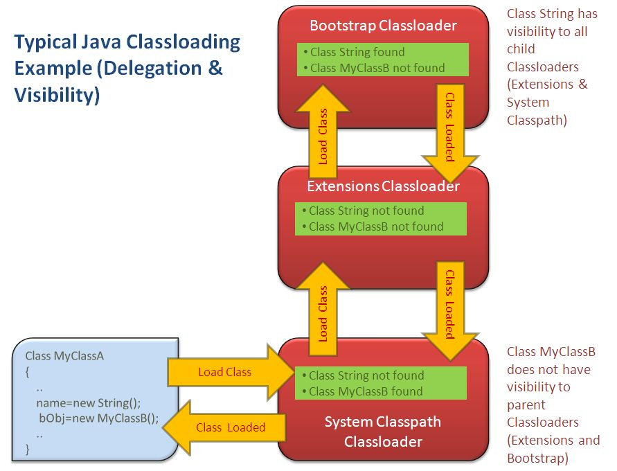

= Classloader

* Las clases son cargadas en memoria por medio de classloaders.
* Una clase se puede inicializar una única vez por classloader.
* Parent First vs Parent Last
** Parent First: Primero se delega el cargado de la clase
** Parent Last: Primero se busca la clase y si no se encuentra se delega

