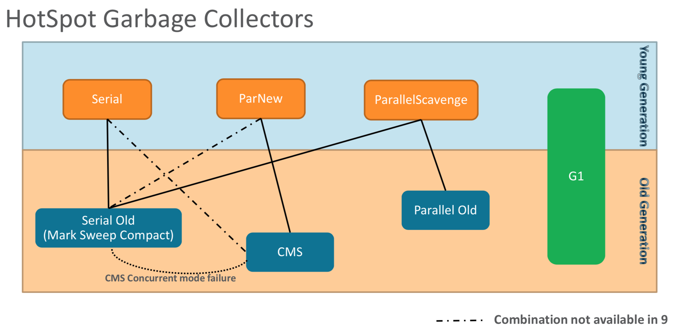

= Garbage Collection

* El Garbage Collector es responsable:
** Asignar memoria.
** Mantener los objetos vivos en la memoria.
** Reclamar el espacio usado por objetos no alcanzables.
* Finalizers:
** Los objetos que tiene el método finalize() son tratados de forma distinta por el GC, ya que primero son depositados en una queue en la cual el `Finalizer` thread va encargándose de llamar al finalize().
* La memoria esta divida en dos areas Old Generation y Young Generation.
* Premisas básicas:
** La mayoría de los objetos mueren jóvenes.
** Pocas referencias desde old objects to young objects.
** Si un objeto de la old generation referencia a uno de la young generation, esto se almacena en algo llamado `card table`, cuando el GC es invocado en la young generation revisa esta tabla.
* Minor vs Major GC: El minor GC solo afecta al Young Generation, Major GC limpiar ambas areas.
* El GC mantiene referencias a los GC Root (Root Set) para ver que objetos son alcanzables (Reachable objects).
* Dependiendo el area podemos seleccionar un algoritmo especifico.
** Young
*** Serial: STW (Stop the world), copying collector single thread.
*** Parallel Scavenge: STW (Stop the world), copying collector con multiples threads.
*** ParNew: STW (Stop the world), copying collector con multiples threads. Version mejorada de Parallel Scavenge.
** Old
*** Serial Old: STW, Mark-Sweep-Compact single thread.
*** CMS: Concurrent Mark Sweep, mayormente concurrente, pausas cortas.
*** Parallel Old: Compacting collector con multiples threads.
* El G1 es un garbage collector que maneja ambas regiones e intenta brindar pausas cortas.
* GC Logging: Desde la version 9 de Java se utiliza la arquitectura de `Unified logging` lo cual cambia la forma de indicar sobre que queremos obtener logging, `link:UnifiedLogging.adoc[detalles]`.
* GC Duration vs GC Pause Duration
** GC Duration: Es la duración total incluye el tiempo de las fases STW y concurrentes.
** GC Pause Duration: Es la duración de las fases STW.
** Java 12 -> https://openjdk.java.net/projects/shenandoah/[Shenandoah]

image::../images/GCCombinations.png[]
