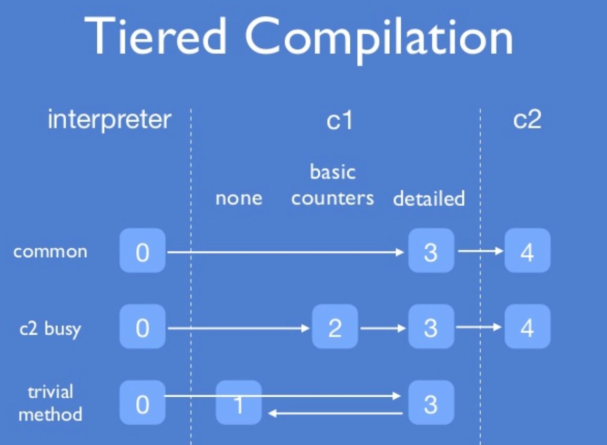
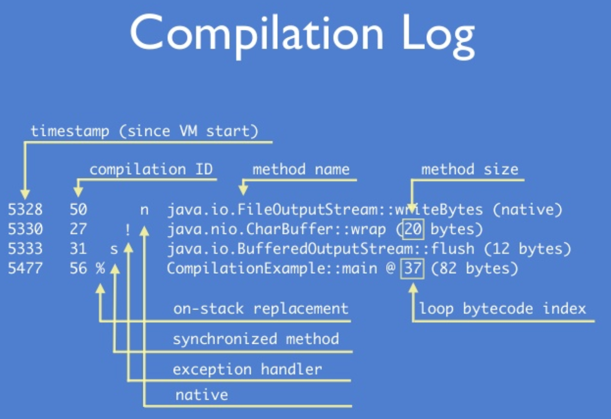

= JIT Compiler

* Java es Compiled e Interpreted.
* Ergonomics define si usamos el C1 (Client Compiler) o C2 (Server Compiler)
* Existen dos JIT compiler C1 y C2.
* Tiered Compilation: Utilizamos ambos compilers. Default desde Java 7. (Interpreted (> 2000) -> C1 (> 15000) -> C2)
* 5 Tiered Compilation Levels
** Level 0: Interpreted mode
** Level 1: C1 with no profiling
** Level 2: C1 with limited profiling
** Level 3: C1 with full profiling
** Level 4: C2 compiled

