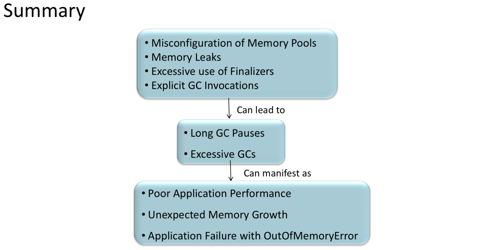

= Memory

* Memory Pools
** PS Eden Space (Heap)
** PS Survivor Space (Heap)
** PS Old Gen (Heap)
** Metaspace (Non Heap): A partir de JDK 8 no se utiliza mas el PermGen y se almacena metadata en esta area, el maximo tamaño es la memoria total o se puede limitar por medio del parámetro MaxMetaspaceSize.
*** Compressed Class Space: Esta area almacena Class metadata y solo es utilizada si las opciones UseCompressedOops y UseCompressedClassPointers están habilitadas.
** Code Cache (Non Heap): Se almacena el código compilado por el JIT (Just In Time) compiler. Memoria nativa controlada por el Code Cache Sweeper.
* Young vs Old Generation: El Young generation esta formado por el Eden Space y los Survivor Space. El Old es simplemente el Old Gen.
* OOM: Cuando la JVM se queda sin memoria en alguna de sus areas
* OOM Types:
** java.lang.OutOfMemoryError: Java heap space: El heap esta lleno, la JVM ya invoco un Full GC, puede ser que el heap es pequeño o que haya un leak.
** java.lang.OutOfMemoryError: GC Overhead limit exceeded: Muchos GCs, liberando poco espacio, application threads no siendo ejecutados, puede ser que el heap o PermGen/Metaspace estén casi llenos.
** java.lang.OutOfMemoryError: Requested array size exceeds VM limit: Heap sin capacidad, el maximo array permitido es Integer.MAX_VALUE-2.
** java.lang.OutOfMemoryError: PermGen Space: Lleno de clases cargadas y metadata y la aplicación quiere cargas mas clases, la JVM ya invoco un Full GC, puede ser que el PermGen es pequeño o que haya un leak.
** java.lang.OutOfMemoryError: Metaspace: Por defecto el Metaspace es ilimitado, su maximo se configura usando `MaxMetaspaceSize`, esta exception indica que esta lleno con clases cargadas y metadata y la aplicación quiere cargar mas, la JVM ya invoco un Full GC, puede ser que el Metaspace es pequeño o que haya un leak.
** java.lang.OutOfMemoryError: Compressed class space: Si la opción `UseCompressedClassPointers` es activada hay dos areas de memoria nativa usadas para las clases y la metadata. Por defecto esta area tiene un maximo de un 1GB.
** java.lang.OutOfMemoryError: Unable to create new native Thread: No hay mas memoria nativa para crear un thread nuevo, esto se puede deber a un thread stack muy grande o muchos threads vivos.
* Native Memory:
** Java Thread Stacks
** Archivos jar y zip
** Bibliotecas nativas
** Recursos nativos e.g. archivos
** Memoria alocada por código nativo e.g. JNI
* OOM Típicos:
** Unbounded caches
** Memory leak static Fields
** Unclosed Resources
** Improper equals() and hashCode() Implementations
** Inner Classes That Reference Outer Classes
** Through finalize() Methods
** Interned Strings
** Using ThreadLocals

