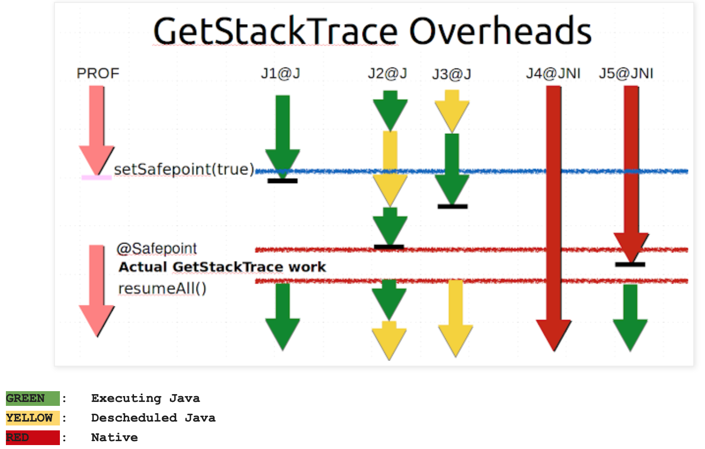

= Safepoints

Algunos tipos de eventos puede ocasionar que la JVM detenga todos los application threads.
Estas pausas son llamadas Stop-The-World (STW) pauses, generalmente vemos esto asociado al GC, pero distintos motivos pueden ocasionar esto:

* GC pauses
* GetAllStackTrace
* Flushing code cache
* Unloading of classes
* Code deoptimization (JIT)
* Biased lock revocation (JIT)
* Moving Objects around to fix memory defragmentation
* Class redefinition (e.g. hot swap or instrumentation)
* Various debug operation (e.g. deadlock check or stacktrace dump)

Los puntos donde los application thread pueden ser suspendidos de forma segura son llamados, safepoints.

El http://openjdk.java.net/groups/hotspot/docs/HotSpotGlossary.html[HotSpotGlossary] define a un safepoint como un punto en el programa en el cual todos los GC roots son conocidos y el contenido de los objetos en el heap es consistente.

== Safepoint process

* Safepoint: Punto de encuentro donde los threads verifican si tiene que detenerse, pero una vez que entraron no pueden salir hasta que la JVM haya terminado.
** Un thread *ESTA* en un safepoint si esta `waiting on a monitor`, `parked`, `blocked on IO`.
** Un thread *ESTA* en un safepoint mientras que ejecuta codigo JNI.
** Un thread ejecutando bytecode *NO ESTA* en un safepoint.
** La JVM no puede forzar a un thread a un safepoint.
** La JVM puede evitar que un thread salga de un safepoint.
* Safepoint triggers/operations: Razón por la cual se solicita hacer un STW, pero la operación solo puede empezar cuando todos estén ahi.
* Safepoint poll: Punto donde los thread verifican si tienen que entrar a un safepoint si es necesario.
** Entre cada 2 lineas de bytecode mientras la ejecución sea interpretada.
** En `non-counted loop back edge` para el código compilado por C1/C2. Si el loop es un `counted loop` no se agrega un safepoint en su ejecución ya que se asume que va a ser rápido.
** En Method entry/exit (entry para Zing, exit para OpenJDK) para el código compilado por C1/C2. Estos safepoints son eliminados si el código es inlined.

Veamos un ejemplo, de un profiler haciendo sampling usando JVMTI::GetStackTrace

El diagrama ejemplifica algunos conceptos:

* Time To Safe Point (TTSP): Cada thread entra a un safepoint cuando llega a un safepoint poll. Pero llegar a un safepoint poll requiere un numero desconocidos de instrucciones.
** El thread J1 llega al safepoint poll de forma inmediata y es suspendido.
** El thread J2 y J3 compiten por el CPU. J3 obtiene el CPU generando que J2 sea enviado a la runnable queue, pero J2 no esta en un safepoint. J3 llega al safepoint poll y suspende. Ahora el core se libera y J2 puede hacer progreso hasta llegar a un safepoint poll.
** J4 y J5 estan en un safepoint mientras ejecutan codigo JNI. J5 intenta volver de JNI en la mitad de un safepoint y es suspendido antes de volver al codigo Java
** Es importante notar que el TTSP es distinto en cada thread y que algunos threads tienen pausas mas largas que otros, si un thread tarda en llegar a un safepoint puede retrasar a los demas.
* Costo de la operacion: Esto va a depender de la operacion. El costo de GetStackTrace va a depender de la profundidad de los stacks, el numero de threads.
* Costo de resumir los threads.

== Safepoints troubleshooting

Normalmente no debemos preocuparnos, ya que suelen funciona, pero algunos parámetros útiles para ver información acerca de esto son:

* -XX:+PrintGCApplicationStoppedTime: Reporta el tiempo pausado por cualquier tipo de safepoint (Incluidos lo del GC).
* -XX:+PrintGCApplicationConcurrentTime: Reporta el tiempo no pausado entre dos safepoints.
* -XX:+PrintSafepointStatistics: Indica a la JVM que debe reportar la razón y el tiempo de los safepoints.
* -XX:PrintSafepointStatisticsCount=1: Indica la cantidad de estadísticas antes de mostrar la informacion.

Combinaciones útiles:

*_-XX:+PrintGCApplicationStoppedTime -XX:+PrintGCDetails nos permite ver si los STW están asociado a GC._*

*_-XX:+PrintSafepointStatistics -XX:PrintSafepointStatisticsCount=1 va informando las estadísticas de cada safepoint_*

== Understading Safepoint Statistics

[source,bash]
----
vmop                    [threads: total initially_running wait_to_block]    [time: spin block sync cleanup vmop] page_trap_count
5.118: RevokeBias                       [      16          1              1    ]      [     0     0     0     0     0    ]  0
----

* Timestamp: El timestamp en milisegundos desde el start de la JVM (5.118 en el ejemplo)
* vmop: El nombre de la operacion que genero la pausa (RevokeBias).
** Si la operacion es `no vm operation`, esto es un `guaranteed safepoint`. Por defecto la JVM dispara un safepoint cada un segundo para procesar las operaciones que no sean tan urgente. El flag `-XX:GuaranteedSafepointInterval` nos permite configurar este tiempo.
* threads:
** total: El numero de threads detenidos en un safepoint (16).
** initially_running: Numero de threads que contribuyen al tiempo de `spin` (1).
** wait_to_block: Numero de threads que contribuyen al tiempo de `block` (1).
* time:
** spin: Tiempo consumido por todos los spinning thread para alcanzar el safepoint.
** block: Tiempo consumido por todos los blocked thread para alcanzar el safepoint.
** sync: Tiempo total consumido para que todos los threads esten en un safepoint.
** cleanup: Tiempo consumido en cleanup interno.
** vmop: Tiempo consumido por la operacion.
* page_trap_count: Numero de `page trap`.

