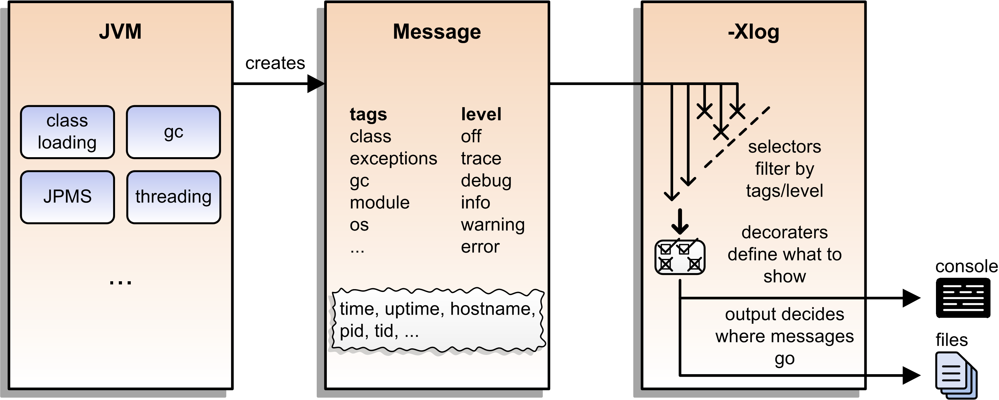
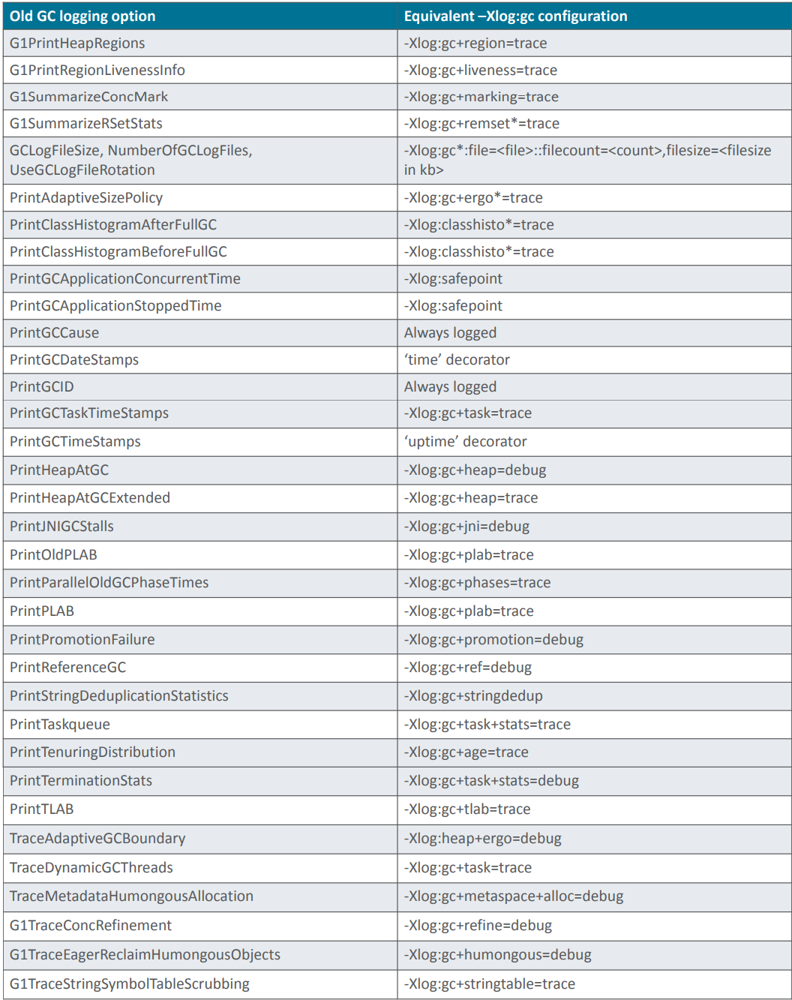

= Unified Logging

La idea es usar un framework común para los mensajes de logging de la JVM.

== Garbage collector

|===
|Java 8 | Java 9+
|-XX:+PrintGCDetails -Xloggc:<gc-log-file-path>	| -Xlog:gc*:file=<gc-log-file-path>
|-XX:+PrintGC -Xloggc:<gc-log-file-path> | -Xlog:gc:file=<gc-log-file-path>
|===

