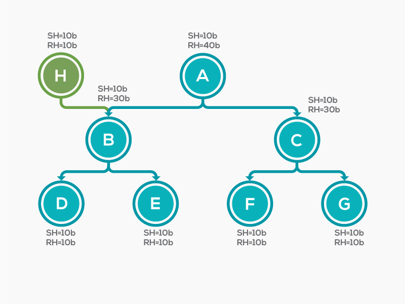

= Memory Analyzer (MAT)

Es una herramienta madura para el análisis de Heap Dumps. Incluye:

* Informes automáticos
* Consultas OQL
* Vista de Dominator Tree
* Vista de Histogram

*Tip*: Cuando esta herramienta analiza nuestro hprof genera algunos archivos adicionales para indexes, asi que es mejor
alocar nuestro hprof en su propia carpeta antes del análisis.

== Dominator Tree

Es una vista donde nos muestra distintos GC Roots y se pueden organizar por Retained Heap.

* *Shallow heap*: Es la memoria consumida por un objeto.
* *Retained set*: El `Retained set` de X, es el conjunto de objetos que sera removido por el GC cuando X sea recolectado.
* *Retained heap*: El `Retained heap` de X, es la sumatoria de los `shallow sizes` de todos los objetos en el `Retained set` de X.

== Histogram

El histograma nos proporciona una vista rápida de los principales consumidores por tipo.

== Thread Overview

Nos brinda una vista util para encontrar cual es el Thread reteniendo mas memoria.

== OQL

Podemos ejecutar queries sobre el estado de nuestro objetos, `link:OQL.adoc[detalles]`.